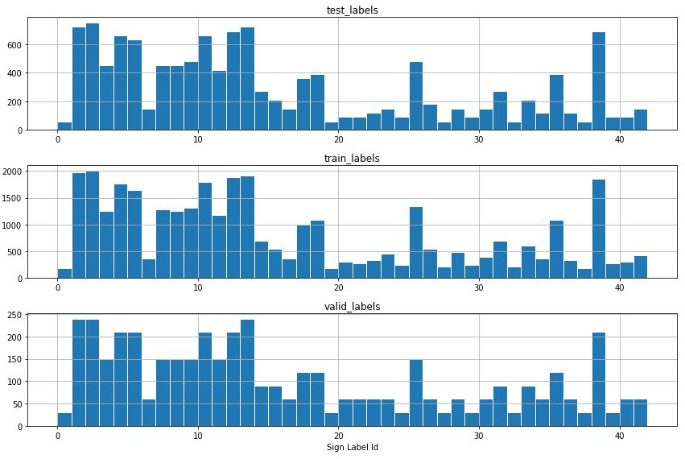
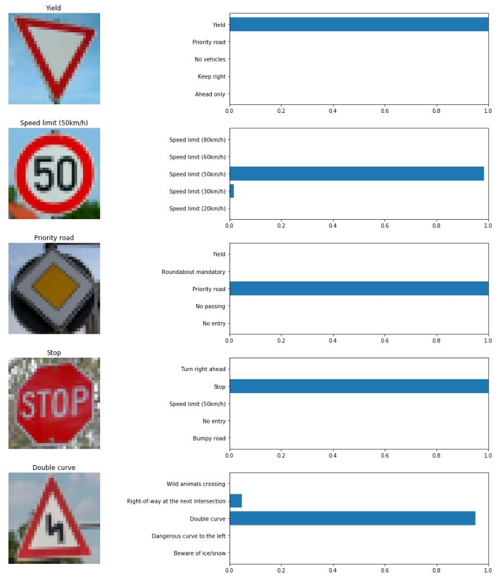

# Traffic Sign Classifier
## Overview
This project uses deep neural networks and convolutional neural networks to classify traffic signs. Specifically, a model is trained to classify traffic signs from the [German Traffic Sign Dataset](http://benchmark.ini.rub.de/?section=gtsrb&subsection=dataset).

The goals / steps of this project are the following:
* Load the data set (see below for links to the project data set)
* Explore, summarize and visualize the data set
* Design, train and test a model architecture
* Use the model to make predictions on new images
* Analyze the softmax probabilities of the new images
* Summarize the results with a written report

Here I will consider the [rubric points](https://review.udacity.com/#!/rubrics/481/view) individually and describe how I addressed each point in my implementation. Here is the link to my [project code](Traffic_Sign_Classifier.ipynb).

### Data Set Summary & Exploration
I used the pandas library to calculate summary statistics of the traffic signs data set:

- The size of training set = 34799
- The size of validation set = 4410
- The size of test set = 12630
- The shape of a traffic sign image = 32x32x3
- The number of classes/labels = 43

The distribution of the training, validation and testing datasets is shown below:



The histograms indicate that the class distribution is very similar between each dataset. It also allows to understand which signs are the most/least common in the datasets. To quantify this, let's count the 5 most and least common classes in the training dataset:

**5 Most common signs:**

|   |Sign name              |Id  |  Number of samples|
|---|-----------------------|:--:|:-----------------:|
|1. |Speed limit (50km/h)   | 2  |2010               |
|2. |Speed limit (30km/h)   | 1  |1980               |
|3. |Yield                  | 13 |1920               |
|4. |Priority road          | 12 |1890               |
|5. |Keep right             | 38 |1860               |

Few randomly selected images representing each class in the 5 most common cases:


**5 Least common signs:**

|   |Sign name              |Id  |  Number of samples|
|---|-----------------------|:--:|:-----------------:|
|1. |End of all speed and passing limits   | 32  |210               |
|2. |Pedestrians   | 27  |210               |
|3. |Go straight or left                   | 37 |180               |
|4. |Dangerous curve to the left          | 19 |180               |
|5. |Speed limit (20km/h)             | 0 |180               |

Few randomly selected images representing each class in the 5 least common cases:


### Data Preprocessing
Before using the images to train the neural network, some image preprocessing is applied to the training dataset. 
#### Convert RGB images to Grayscale
The initial test images are stored as RGB colorspace arrays. This is a 3 channel representation where the values for each channel (Red, Green, Blue) can go from 0 (dark) to 255 (bright).
In this step transformation from RGB space is applied to convert the image into Grayscale. 

The conversion from a RGB image to gray is done with:

```python
gray = cv2.cvtColor(image, cv2.COLOR_RGB2GRAY)
```

The reason to convert the image to grayscale is to reduce # color channels and therefore make the neural network training faster. 
The assumption in this case is that color is not relevant for the traffic sign recognizer. One example where color would be of utmost importance would be traffic light recognizer and in that case RGB to GRAY scale conversion must not be applied!

#### Image Normalization
This processing changes the range of pixel intensity values. There are many algorithms to normalize an image. 
In this case the simplest way to normalize each image was used by dividing the pixel value by 255 and so normalizing each image to have value range between 0-1. Normalization helps in neural network training phase as it ensures the value range is similar between all features and no dominating features are present in the dataset.   

Here is few examples of traffic sign images before


and after preprocessing:


### Model Architecture
The infamous LeNet convolutional neural network structure (Yann LeCun et al. in 1998) was used as a reference for model structure.
The main changes consist of including dropout layer that helps to ensure the model doesn't overfit.

Here is the final model architecture:
|Layer|Description|
|---|---|
|Input| 32x32x1 image|
|Convolution 5x5| 1x1 stride, VALID padding, output 28x28x6 |
|relu| activation function|
|Max Pooling|2x2 kernel, 2x2 stride, VALID padding, output 14x14x6|
|Convolution 5x5| 1x1 stride, VALID padding, output 10x10x16 |
|relu| activation function|
|Max Pooling|2x2 kernel, 2x2 stride, VALID padding, output 5x5x16|
|Dropout|keep probability 60%|
|Fully connected|input 400, output 200|
|relu| activation function|
|Dropout|keep probability 60%|
|Fully connected|input 200, output 82|
|relu| activation function|
|Dropout|keep probability 60%|
|Fully connected|input 82, output 43|

### Train and Test NN Model
To train the model, I used Adam Algorithm which is an extension of stochastic gradient descent. Whereas the Stochastic gradient descent maintains a single learning rate for all weight updates and the learning rate does not change during training, Adam computes individual adaptive learning rates for different parameters from estimates of first and second moments of the gradients.

To make sure the training is not skewed by the order of images in the training set, the implemented training pipeline randomly shuffles the training set each time before next epoch start.

Some hyperparameters I chose for the nn training: 

- `EPOCHS` = 70
- `BATCH_SIZE` = 256
- `rate` = 8e-4

My final model results were:

- training set accuracy: 99%
- validation set accuracy: 96%
- test set accuracy: 95%

### Test the Model on New Images

Here are five German traffic signs that I found on the web:


From the visual inspection, none of them should be difficult to classify.

I applied the same preprocessing to these images as to the training dataset. Running the images through the traffic sign classifier results in prediction accuracy of 100%.

|Label|Prediction|
|---|---|
|Yield|Yield|
|Speed limit (50km/h)|Speed limit (50km/h)|
|Priority road|Priority road|
|Stop|Stop|
|Double curve|Double curve|

For each of the 5 images, I printed out the model's softmax probabilities to show the certainty of the model's predictions.
The function `tf.nn.top_k` was used to select the top 5 class probabilities predicted by the traffic sign classifier.


